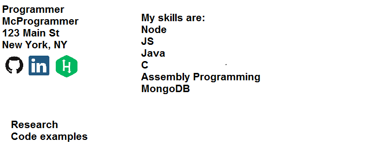
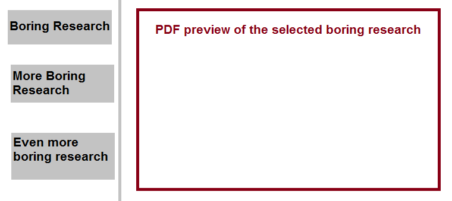
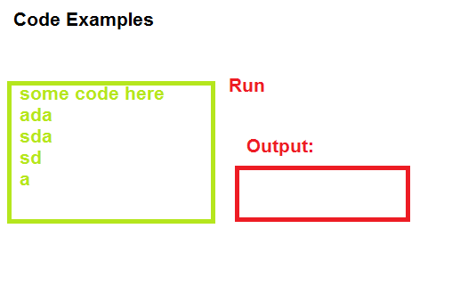
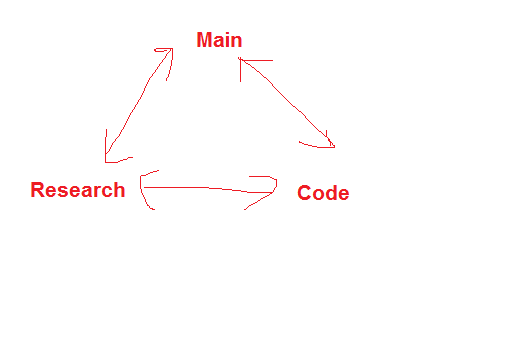

# Online Portfolio

## Overview

This will serve as a pretty minimal online portfolio, but with some interesting features. 
It will include example code, that is compileable/runnable/editable, in order to let someone show off their coding skillz

## Data Model

A single admin user will exist, who will be able to add more code examples, AND upload pdf publications for the site. 


An example portfolio holder
```javascript
{
  username: "Programmer McProgrammerface,
  skills: //list of skills
  hackerrank: //hackerrank link
  github: //github link
  linkedin: //linkedin link
}
```

An example PDF publication
```javascript
{
  name: "Refining Thin Clients Using Linear-Time Models",
  filename: //filename,
}
```

An example code snippet
```javascript
{
  language: "C"
  code: //insert code here. 
}
```

## [Link to Commented First Draft Schema](db.js) 

(___TODO__: create a first draft of your Schemas in db.js and link to it_)

## Wireframes
/doc/main - show main skills and stuff



/doc/research - page for showing all research



/doc/code - page for showing off code snipper




## Site map



## User Stories or Use Cases

As any user I can view the home page, code page, and research page.

## Research Topics


* (2 points) Use PDF viewer library
    * Will use this library to display research papers that have been uploaded to the server, without requiring the user to download them. 
    
* (6 points) Editable/compilable code 
    * https://www.npmjs.com/package/codemirror Will use code mirror to display editable code.
    * While the library itself isn't 6 points difficult to use, having code be compiled on the server I expect will be difficult

8 points total out of 8 required points 

## [Link to Initial Main Project File](app.js) 


## Annotations / References Used

(___TODO__: list any tutorials/references/etc. that you've based your code off of_)

1. [PDF viewer NPM page](https://www.npmjs.com/package/pdf-viewer) 
2. [Codemirror NPM page](https://www.npmjs.com/package/codemirror)
3. [Quora page describing online compiler usage](https://www.quora.com/How-do-I-create-online-compiler-for-C-C++-and-Java-using-node-js-as-server-language)


